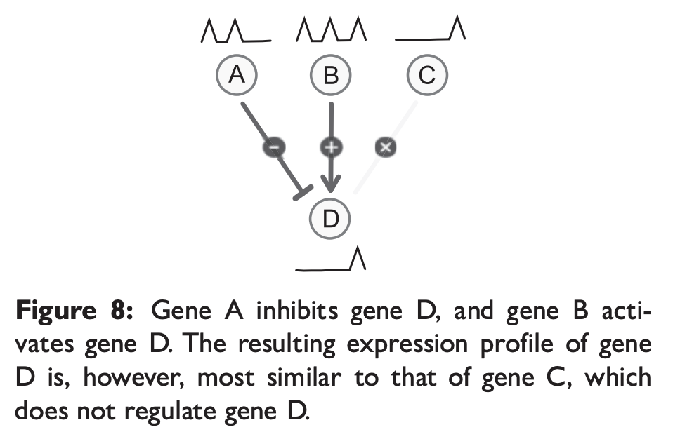

# Sup, semi-sup, unsup inference

Maetschke, Stefan R., Piyush B. Madhamshettiwar, Melissa J. Davis, and Mark A. Ragan. "Supervised, semi-supervised and unsupervised inference of gene regulatory networks." Briefings in bioinformatics 15, no. 2 (2014): 195-211. [[PDF (main)](https://nbviewer.jupyter.org/github/dennissxz/gene-regulatory-networks/blob/main/reading/grn-ssu.pdf)] [[PDF (with supplementary material)](https://arxiv.org/pdf/1301.1083.pdf)]

Evaluate ssu methods on simulated and experimental expression data.

Results:
- low prediction accuracies for unsupervised methods
  - except for Z-Score method on knockout data
- sup approach achieves highest accuracies
- semi-sup with small numbers of only positive samples, outperform unsup techniques.

Problem
- experimental methods for GRN inference are time-consuming, expensive and require antibodies for each TF [2].

gene data types
- knockout, knockdown and multifactorial, microarray (??)

dataset
- Dialogue for Reverse Engineering Assessments and Methods (DREAM), an annual open competition in network inference

simulation
- To avoid discrepancies between the gene expression values generated by true regulatory networks
and the actually known, partial networks, we performed evaluations on simulated, steady-state expression data.
- This allowed us to assess the accuracy of an algorithm against a perfectly known true network [21]
- use GeneNetWeaver [12, 24] and SynTReN [25] simulators

- GeneNetWeaver (#exp=#genes)
  - extract **subnetworks** from known interaction networks (E. coli and S cerevisiae networks)
  - simulate transcription and translation
  - uses a set of ordinary differential equations describing chemical kinetics to generate expression data for experiments
    - knockout: expression value of each gene is set to 0 in turn (hence #exp = #genes)
    - knockdown: halved
    - multifactorial: expression levels of a small number of genes are perturbed by a small random amount.

- SynTReN: similar but older simulator, faster than Gene NetWeaver, allows one to vary the sample number independently of the network size.
  - extract E coli and S cerevisiae
  - simulate transcription only
  - simulate multifactorial only

Note
- Because many methods are not designed to infer self-interactions or interaction direction, we disregard directed edges and self-interactions.

## Unsupervised

unsup rely on gene expression profiles data  only.

| Method | Formula | Remark|
| - | - | - |
| Correlation   | Pearson, Spearmane, Kendalls | +tive: activating. -tive: inhibitory. Use absolute value since the evluation does not distinguish between inhibiting and activating|
| SPEARMAN-C  |  $w_{i j}=\left|\operatorname{corr}\left(X_{i}, X_{j}\right) \cdot \frac{1}{n} \sum_{k}^{n} \operatorname{corr}\left(X_{i}, X_{k}\right)\right|$ |  favor hub nodes, which have many, strong interactions. |
| WGCNA [30] Weighted gene co-expression network analysis  | $w_{i j}=\left|\operatorname{corr}\left(X_{i}, X_{j}\right)\right|^{ \beta}, \beta \ge 1$  |  Amplifies high correlation. Monotonic, hence not change AUC |
| RN [31] relevance netwoks   |  empirical mutual information |   |
| CLR [11] context likelihood of relatedness  | $z_{i}=\max _{j}\left(0, \frac{I\left(X_{i}, X_{j}\right)-\mu_{i}}{\sigma_{i}}\right),$ $w_{i j}=\sqrt{z_{i}^{2}+z_{j}^{2}}$  | take backgounrd distribution into account, reduce the false prediction based on spurious correlations and indirect interactions.  |
| ARACNE [13] accurate cellular networks | $I\left(X_{i}, X_{j}\right) \leq \min \left(I\left(X_{i}, X_{j}\right), I\left(X_{j}, X_{k}\right)\right)$ pruned triplet if they violate the DPI beyond tolerance  |  Better than RN BN. Applies Data processing inequality (DPI) |
| PCIT [29] practical correlation and information theory | $\text { corr }_{i j}^{\text {partial }}=\frac{\operatorname{corr}\left(X_{i}, X_{j}\right)-\operatorname{corr}\left(X_{i}, X_{k}\right) \operatorname{corr}\left(X_{j}, X_{k}\right)}{\sqrt{\left(1-\operatorname{cor}\left(X_{i}, X_{k}\right)\right)^{2}\left(1-\operatorname{corr}\left(X_{j}, X_{k}\right)\right)^{2}}}$  | Similar to ARACNE, but uses  partial correlation instead of MI. Aims to eliminate the effect of the third gene k on the correlation of genes i and j. |
| MRNET [14]    |   |  MI between expression profiles and a feature selection algorithm minimum-redundancy–maximum-relevance (MRMR) |
| MRNET-B   |   |  modification of MRNET. Replaces forward selection by backward selection. |
| GENIE  |   |  Similar to MRNET, but random forests and extra-trees are used for regression and feature selection rather than MI and MRMR |
| SIGMOID   |   | models the regulation of a gene by a linear combination with sigmoid function.  |
| MD [33] Mass-distance   |  $\operatorname{MASS}_{k}\left(X_{i}, X_{j}\right)=\sum_{\min \left(X_{i k}, X_{j k}\right) \leq x \leq \max \left(X_{i k}, X_{j k}\right)} f r e q(x)$ $w_{ij} = \mathrm{MD}_{i j}:=\prod_{k}^{n} \operatorname{MASS}_{k}\left(X_{i}, X_{j}\right)$ | It estimates the probability to observe a profile inside the volume delimited by the profiles. Smaller the volume, more similar are the two profiles  |
| Mutual rank [34]   |  $\operatorname{rank}_{i j}=\operatorname{rank}_{j}\left(\operatorname{corr}\left(X_{i}, X_{k}\right), \forall k \neq i\right)$, $w_{i j}=\frac{\operatorname{rank}_{i j} \cdot \operatorname{rank}_{j i}}{2}$ |  ranked Pearson's correlation |
| MINE [28] Maximal information nonparametric exploration   |  $w_{i j}=\operatorname{MIC}\left(X_{i}, X_{j}\right)$ | mutual information coefficient  |
| EUCLID  | $w_{ij} = \left\|X _i - X _j \right\|$  | Euclidean distance  |
| Z-SCORE [7]   |  $z_{ij} = \frac{X_{jk} - \mu (X_j)}{\sigma (X_j)}$, $w_{ij} = \max (z_{ij}, z_{ji})$ | Describes the effect of a knockout of gene $i$ in the $k$-th experiment on gene $j$. (typo??) To generalize to other two types of experiment, replace $X_{jk}$ by $\min (X_j)$, i.e. assuming that the minimum expression value within a profile indicates the knockout experiment ($z_{ij}$ = constant for all $i$ ??) |

## Supervised

sup: requires all edges are labeled (either positive or negative). Usually #positive >> #negative

- commonly used: SVM for inference of gene regulatory networks [9].
- implementation: SVMLight [35]
- feature vector: $\boldsymbol{x} = X_i X_j ^{\top}$, which is communicative (??)
- feature label: $\gamma = 1$ for gene pairs that interact and $-1$ otherwise

## Semi-supervised

Data issue
- Data describing regulatory networks are sparse and typically only a small fraction of the true interactions is known.
- The situation is even worse for negative data (non-interactions) because experimental validation largely aims to detect but not exclude interactions.

- The case that all samples within a training data set can be labeled as positive or negative is therefore rarely given for practical network inference problems, and supervised methods are limited to small training data sets, which negatively affects their performance.

pros
- semisup can be trained with much fewer labels (positive + negative, or positive only), but not as accurate predictors as sup

Model [10]
- To enable the SVM training, which requires all samples to be labeled, all unlabeled samples within the semi-supervised training data are relabeled as **negatives**.
- This effect on model performance is investigated.

## Experiments and Results

### Unsupervised

For a model, repeat 10 times:

- For $N_v= 10, 30, 50, 70, 90, 110$
    - extract $N_v$ number of genes from E. Coli and (??) S. cerevisiae
    - simulate expression data for three type of experiments. For each type,
      - collect $N_v$ number of samples
      - compute AUC

Findings
- large sd of AUC
- a simple Pearson’s correlation is consistently the second-best performer for all experimental types.
- ZSCORE was specifically designed for knockout data and indeed clearly outperforms all other methods for this experimental type.
- For small networks, the accuracy of a method can easily vary between no better than guessing to close to perfect
- some methods are sensitive to network size, some not (Fig 4)
- observe trend of improving accuracy with increasing number of samples and decreasing size of network, but absolute improvements with additional samples are small. most likely because unsupervised methods can infer only simple network topologies reliably and small sample sets are sufficient for this purpose

### Supervised and semisupervised

vary:
- percentage of labeled data (10, 30, 50, 70, 90, 100% (sup))
- positive only, or both, in the lebeled data.

results
- performance increases with the percentage of data labeled
  - but there is little difference between labeling only positive data, and both positive and negative data
- Even with as little as 10% of known interactions, semi-supervised methods still outperform unsupervised methods for multifactorial data.
- The Z-SCORE method is still the top-performing method on knockout data
- Knockout data are more informative for network inference than
knockdown or multifactorial data.

To summarize, apart from the Z-SCORE method on knockout data, supervised and semi-supervised approaches considerably outperform unsupervised methods and achieve good prediction accuracies in general for networks of this size.

## Real data

In addition to simulated data, we also evaluated all methods on two experimental data sets originating from the fifth DREAM systems biology challenge [8]. Specifically, we downloaded
- an E. coli network with 296 regulators, 4297 genes and the corresponding expression data with 487 samples, and
- an S. cerevisiae network with 183 regulators, 5667 genes and expression data with 321 samples.

Both data sets are described in detail in the Supplementary Material of [8].

We applied the same methodology and used GeneNetWeaver to randomly extract subnetworks with 30 nodes from the experimental networks.

Findings
- The results on the experimental data are in good agreement with the simulation results
- The accuracy of the unsupervised methods remains low, while the supervised methods perform dramatically better.

## Limitation

- only evaluate methods predicting undirected interaction (since most methods are these kind)
  - only a small subset of methods can infer direction or loops natively (e.g. GENIE [27]).

- only predict interaction/non-interaction, rather than type of interaction

- supervised method do not know which gene has been knocked out or knocked down (metadata), which is provided in DREAM challenge, since most methods do not use that.

- simulation method remain incomplete
  - posttranscriptional regulation and chromatin states are missing,
  - an evaluation of inference methods on real data would clearly be preferable. but such data is usually not available (2013).

- only use linear SVMs, since
  - faster to train
  - small number of samples

- outer product
  - [10] use concatenation, non-linear SVM. More time-consuming to train and two parameters to be optimized.
  - $\boldsymbol{x}$ is a matrix?? vectorization? communtative?

- unbalanced data sets
  - +ve >> -ve
  - no improvements after chenge weight

Mixed regulatory networks
- Z-SCORE method fails when a gene is regulated by an or-junction of two genes
- Unsupervised methods are appropriate for the inference only of simple networks that are entirely composed of inhibitory or activating interactions but not both.
- any method that infers interactions from the similarity of expression profiles alone (without further information e.g. knowckouts, existing interactions) is prone to fail in a mixed regulartory case. See Fig 8.
  - Schaffter et al. [12] identify other common network motifs and the methods that tend to infer them **incorrectly**
  - Krishnan et al. [38] show that networks of a certain complexity cannot be reverse-engineered from expression data **alone**.

## Ref of interest

unsup method: how to do classification from weights?
- e.g. mutual information?

SIRENE [9] supervised inference of regulatory networks, using SVM

Z-score [7]
- typo ??
- $z_{ij}$ = constant for all $i$ ??

Marbach et al. [8]
- infer the complete network with >5000 nodes
- suggest that incorporating additional information such as transcriptionfactor binding and chromatin modification data or promoter sequences might improve the accuracy of prediction.

Qs
- can we predict type of edge, from binary (null, interaction) to 3 class (null, inhibitory, activating)?
- how to deal with complex regulatory problem in Fig 8? need a special aggregation function in GNN?
  - in message passing, some inhibitory, some activating
  - differ from the 'homopholy' assumption
