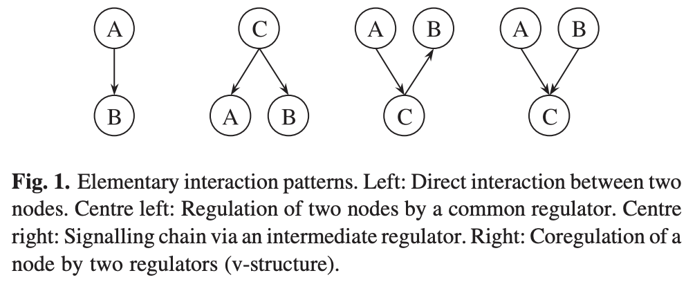
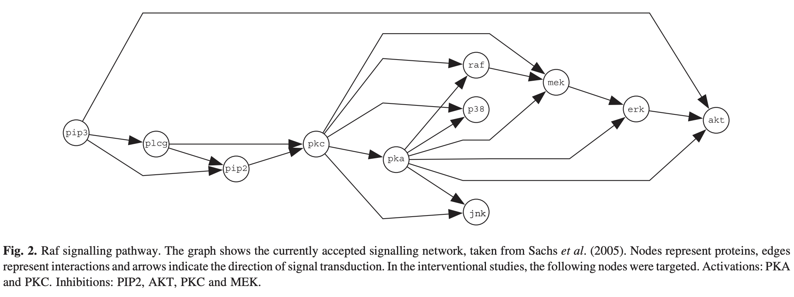

# Compare RN GNN BN

[[PDF](https://nbviewer.jupyter.org/github/dennissxz/gene-regulatory-networks/blob/main/reading/grn-ggm.pdf)][[DOI](https://academic.oup.com/bioinformatics/article/22/20/2523/218029)] Werhli, A. V., Grzegorczyk, M., & Husmeier, D. (2006). Comparative evaluation of reverse engineering gene regulatory networks with relevance networks, graphical Gaussian models and Bayesian networks. Bioinformatics, 22(20), 2523-2531.

## Abstract

Compare the accuracy of reconstructing gene regulatory networks with three different modelling and inference paradigms:

1. Relevance networks (RNs): pairwise association scores **independent** of the remaining network;
1. graphical Gaussian models (GGMs): undirected graphical models with **constraint-based** inference
1. Bayesian networks (BNs): directed graphical models with **score-based** inference

Dataset: Raf pathway, a cellular signalling network describing the interaction of 11 phosphorylated proteins and phospholipids in human immune system cells.
- lab data from cytometry experiments
- simulated data from gold-standard network
- passive observations with active interventions ??

Results:
- On Gaussian observational data, BNs and GGMs were found to outperform RNs.
- The difference in performance was not significant for the non-linear simulated data and the cytoflow data,though.
- Also, we did not observe a significant difference between BNs and GGMs on observational data in general.
- However, for interventional data, BNs outperform GGMs and RNs, especially when taking the edge directions rather than just the skeletons of the graphs into account. This suggests that the higher computational costs of inference with BNs over GGMs and RNs are not justified when using only passive observations, but that active interventions in the form of gene knockouts and over-expressions
are required to exploit the full potential of BNs.

Data, software and supplementary material are available from http://www.bioss.sari.ac.uk/staff/adriano/research.html. (Page not found)

## Methods

### RNs

The method of RNs, proposed by Butte and Kohane (2000, 2003), is based on
pairwise association scores **indepdent** of the remaining network. These scores are computed for all pairs of nodes from the signals associated with the nodes. The authors propose the mutual information and the Pearson correlation as appropriate association scores.

- Pros: This approach is straightforward to implement, and its computational costs are comparatively low. The principled disadvantage of RNs,
- Cons: however, is that the inference of an interaction between two nodes is not done in the context of the whole system. Consequently, we expect that RNs are not particularly powerful in distinguishing between direct (Fig. 1, left) and indirect (Fig. 1, centre) interactions.

:::{figure} interaction-pattern

Interaction patterns
:::

### GGMs

GGMs are **undirected** probabilistic graphical models that allow the identification of **conditional independence** relations among the nodes under the assumption of a multivariate Gaussian distribution of the data. The inference of GGMs is based on a (stable) estimation of the **covariance matrix** of this distribution.

A high correlation coefficient between two nodes may indicate
- a direct interaction (Fig. 1, left).
- an indirect interaction (Fig. 1, centre right)
- or a joint regulation by a common (possibly unknown) factor (Fig. 1, centre left).
However, only the direct interactions are of interest to the construction of a regulatory network.

The strengths of these direct interactions are measured by the partial correlation coefficient $\rho_{ik}$, which describes the correlation between nodes $X_i$ and $X_k$ conditional on all the other nodes in the network. It can be computed by the inverse of the covariance matrix $\boldsymbol{C}$.

$$
\rho_{i k}=-\frac{C_{i k}^{-1}}{\sqrt{C_{i i}^{-1} C_{k k}^{-1}}}
$$

To infer a GGM, one typically employs the following procedure. From the given data, the empirical covariance matrix is computed, inverted and the partial correlations $\rho_{ik}$ are computed from the equation above. The distribution of $\left\vert \rho_{ik} \right\vert$ is inspected, and edges $(i, k)$ corresponding to significantly small values of $\left\vert \rho_{ik} \right\vert$ are removed from the graph. The critical step in the application of this procedure is the stable estimation of the covariance matrix and its inverse.

In this paper we uses a novel covariance matrix estimator regularized by a shrinkage approach (Schafer and Strimmer, 2005a)

### Bayesian Networks

BNs are **directed** graphical models for representing probabilistic relationships between multiple interacting entities. Formally, a BN is defined by a graphical structure $M$, a family of (conditional) probability distributions $F$, and their parameters $q$, which together specify a joint distribution over a set of random variables of interest.

The graphical structure $M$ of a BN has to be a directed acyclic graph (DAG), i.e. a network without any directed cycles. This structure defines a unique rule for expanding the joint probability in terms of simpler conditional probabilities. Let $X_1, X_2, \ldots, X_n$ be a set of random variables represented by the nodes $i \in \left\{ 1, 2, \ldots, n \right\}$ in the graph, define $\operatorname{pa} [i]$ to be the parents of node $X_i$, and let $X_{ \operatorname{pa}[i] }$ represent the set of random variables associated with $\operatorname{pa}[i]$. Then the joint distribution can be factorized as

$$
P\left(X_{1}, \ldots, X_{n}\right)=\prod_{i=1}^{n} P\left(X_{i} \mid X_{\mathrm{pa}[i]}\right)
$$

When adopting a score-based approach to inference, our objective is to sample model structures $M$ from the posterior distribution

$$
P(M \mid D) \propto P(D \mid M) P(M) \qquad (3)
$$

which requires a marginalization over the parameters $q$

$$
P(D \mid M)=\int P(D \mid q, M) P(q \mid M) \mathrm{~d} q \qquad (4)
$$

If certain regulatory conditions, discussed in Heckerman (1999), are satisfied and the data are complete, then the integral in (4) is analytically tractable. Two function families F that satisfy these conditions are
- the multinomial distribution with a Dirichlet prior Heckerman et al., 1995)
- and the linear Gaussian distribution with a normal-Wishart prior (Geiger and Heckerman, 1994).

The resulting scores P(D j M) are usually referred to as the **BDe** (discretized data, multinomial distribution) or the **BGe** (continuous data, linear Gaussian distribution) score.

Direct sampling from the posterior distribution (3) is analytically intractable, though. Hence, a Markov Chain Monte Carlo (MCMC) scheme is adopted (Madigan and York, 1995), for which an efficient proposal algorithm based on node orders has recently been proposed (Friedman and Koller, 2003).

## Datasets

Raf is a critical signalling protein involved in regulating cellular proliferation in human immune system cells. The deregulation of the Raf pathway can lead to carcinogenesis, and the pathway has therefore been extensively studied in the literature.

:::{figure} Raf-pathway

Raf pathway
:::

Uses four types of data {passive observation, active interventions} $\times$ {lab data, simulated data}.

### Observational

Sachs et al. (2005) have applied intracellular multicolour flow cytometry experiments to quantitatively measure protein expression levels. Data were collected after a series of stimulatory cues and inhibitory interventions targeting specific proteins in the Raf pathway.

### Simulation

#### Linear Gaussian Distribution

A simple synthetic way of generating data from the gold standard network of Figure 2 is to sample them from a linear-Gaussian distribution. The random variable $X_i$ denoting the expression of node $i$ is distributed according to

$$
X_{i} \sim N\left(\sum_{k} w_{i k} x_{k}, \sigma\right) \qquad (5)
$$

We set the standard deviation to $\sigma = 0.1$, sampled the interaction strength $\left\{ w_{ik} \right\}$ from the uniform distribution over the interval $[0.5,2]$, and randomly varied the sign of $w_{ik}$.

For simulating (noisy) interventions, we replaced the conditional distribution (5) by the following
unconditional distributions.
- For inhibitions, we sampled $X_i$ from a zero-mean Gaussian distribution $\mathcal{N} (0,\sigma)$.
- For activations, we sampled $X_i$ from the tails of the empirical distribution of $X_i$, beyond the
2.5 and the 97.5 percentiles.

#### Realistic Non-linear Simulation

A more realistic simulation of data typical of signals measured in molecular biology is the following approach. The expression of a gene is controlled by the interaction of various transcription factors, which may have an inhibitory or activating influence. Ignoring time delays inherent in transcription and translation, these interactions can be compared with **enzyme–substrate reactions in organic chemistry**. From chemical kinetics it is known that the concentrations of the molecules involved in these reactions can be described by a system of ordinary differential equations (ODEs) (Atkins, 1986). Assuming **equilibrium** and adopting a steady-state approximation, it is possible to derive a set of closed-form equations that describe the product concentrations as non-linear (sigmoidal) functions of combinations of substrates.

To model stochastic influences, we subjected all nodes to additive Gaussian noise, and repeated the simulations for three different noise levels. Interventions were simulated by drawing values from a peaked Gaussian distribution (s ¼ 0.01) around the maximum (activation) and minimum (inhibition) values of the domain.

#### Data size

Flow cytometry allows the simultaneous measurement of the protein expression levels in thousands of individual cells. Sachs et al. (2005) have shown that for such a large dataset, it is possible to reverse engineer a network that is very similar to the known gold standard Raf signalling network. However, for many other types of current postgenomic data, such abundance of data is not available. We therefore sampled the data of Sachs et al. (2005) down to 100 data points; this is a representative figure for the typical number of different experimental conditions in current microarray experiments.

#### Implementation

To avoid the perturbing influence of additional decision factors, e.g. related to data discretization, and to enable a fair comparison with GGMs, we use the Gaussian assumption throughout. To minimize the deviation from this assumption, we subjected the data to a quantile normalization, ensuring that all marginal distributions of individual nodes were Normal.

For BNs
- Applying the Gaussian assumption to BNs, with the normalWishart distribution as a conjugate prior on the parameters, the integral in (4) has a closed-form solution, referred to as the BGe score.
- We followed Friedman and Koller (2003) and chose a distribution that is uniform over parent cardinalities subject to a fan-in restriction of 3 (??)
- We carried out MCMC over node orders, as proposed in Friedman and Koller (2003).

For RNs
- we computed the pairwise node associations with the Pearson correlation

For GGMs,
- We computed the covariance matrix in GGMs with the shrinkage approach proposed by Scha¨fer
and Strimmer (2005b), choosing a diagonal matrix as the shrinkage target. Note that this target corresponds to the empty prior network; hence the effect of shrinkage is equivalent to the selected prior for the computation of the BGe score in BNs.

## Results

### Metrics

- Undirected graph evaluation (UGE) discards the information about the edge directions altogether. The original and learned networks are replaced by their **skeletons**, where the skeleton is defined as the network in which two nodes are connected by an undirected edge whenever they are connected by any type of edge.
- Directed graph evaluation (DGE), compares the predicted network with the original directed graph. A predicted undirected edge is interpreted as the superposition of two directed edges, pointing in opposite directions.

- AUC: Each of the three reverse engineering methods compared in our study leads to a matrix of scores associated with the edges in a network. These scores are of different nature: correlation coefficients for RNs, partial correlation coefficients for GGMs and marginal posterior probabilities for BNs. All three scores define a ranking of the edges. Hence, we can plot ROC curve and compute AUC. However, AUC does not lead to a specific network prediction.

- TP: Select a threshold from which a specific network prediction is obtained. Scha¨fer and Strimmer (2005a) discuss a method for converting the (partial) correlation coefficients of RNs and GGMs into q-values [i.e. p-values corrected for multiple testing; see Storey and Tibshirani (2003)] and ‘posterior probabilities’. We chose the threshold such that it led to a fixed count of five FPs. This procedure is guaranteed to compare the competing methods at the same operation point on the ROC curves, and the evaluation can therefore simply be based on the **TP** counts.

### Comparison

- GGMs and BNs potentially distinguish between direct and indirect interactions and therefore provide a more powerful modelling approach than RNs.

- BNs have the potential to present a more refined picture of interactions among nodes than GGMs owing to the directed nature of the edges.

- Dependence on the noise level: when increasing the noise level, the performance with BNs first increases, and then decreases.

- BNs and GGMs tend to outperform RNs, but the difference is less pronounced for the non-linear simulated data (Netbuilder) and the measured protein concentrations (cytometry experiments) than for Gaussian data. Also, there is insufficient evidence for any significant difference between BNs and GGMs on observational data.

- BNs outperform GGMs and RNs when taking the edge directions into account. This suggests that the higher computational costs of inference with BNs over GGMs and RNs are not justified for passive observations, but that active interventions in the form of gene knockouts and over-expressions are required to exploit the full potential of BNs

## Reference

- GRN with BNs, Friedman et al., 2000
- RNs (Butte and Kohane, 2000, 2003)
- GNNs (Schafer and Strimmer, 2005a)
- GGM vs BN on synthetic data (Pournara (2005)). This paper
  - improved BN learning, MCMC rather than optimization scheme
  - improved GGM, a more recent algo rather than PC algo
  - include RNs, low computational cost
  - use Raf pathway rather than random GRN.
